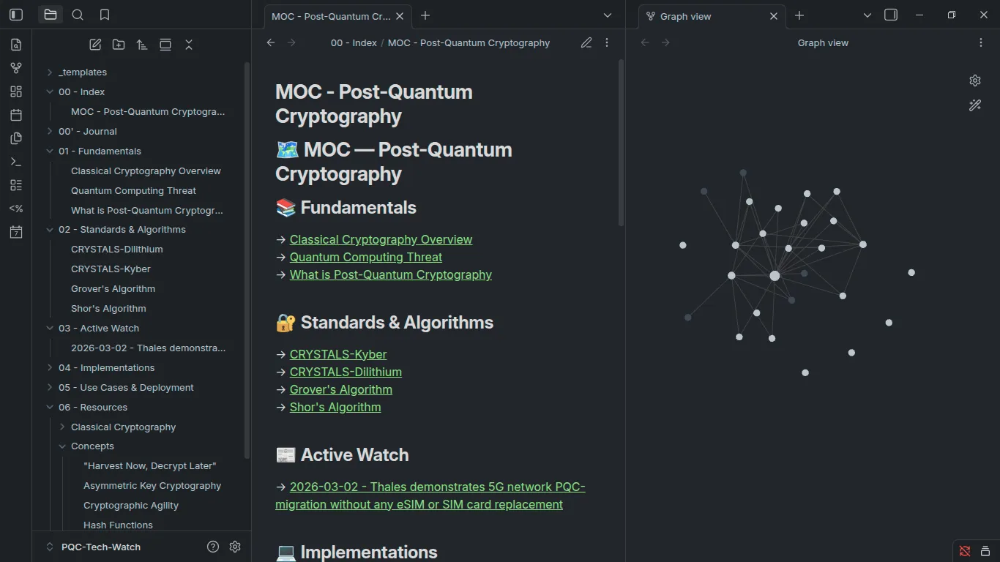

# 🔐 Tech Watch – Post-Quantum Cryptography

This repository is a personal knowledge hub dedicated to my tech watch on **Post-Quantum Cryptography (PQC)** and classical cryptography.
Notes and resources are structured using **Obsidian** and **NotebookLM**, with active monitoring via **Google Alerts**.
It covers the transition from classical to quantum-resistant algorithms, following NIST PQC standardization efforts.

> ⚠️ **Work in progress** – This repository is actively evolving. New notes, resources, and topics are added on a regular basis as my tech watch progresses.

---

## 🎯 Objectives

- Monitor the latest developments in Post-Quantum Cryptography
- Understand the threats posed by quantum computing on current cryptographic systems
- Study NIST PQC standards and finalist algorithms
- Build a structured and evolving knowledge base using Obsidian
- Deepen understanding of classical cryptography foundations

---

## 🛠️ Tools used

- **Obsidian** – local knowledge base and note-taking (Markdown vault)
- **NotebookLM** – AI-assisted document analysis and synthesis
- **Google Alerts** – real-time monitoring of PQC-related news and publications

---

## 🗂️ Vault structure

- 00 - Index
  - MOC - Post-Quantum Cryptography
- 00' - Journal
- 01 - Fundamentals
  - Classical Cryptography Overview
  - Quantum Computing Threat
  - What is Post-Quantum Cryptography
- 02 - Standards & Algorithms
  - CRYSTALS-Kyber
  - CRYSTALS-Dilithium
  - Grover's Algorithm
  - Shor's Algorithm
- 03 - Active Watch
- 04 - Implementations
- 05 - Use Cases & Deployment
- 06 - Resources
  - Classical Cryptography
  - Concepts

---

## ✨ Topics covered

- Fundamentals of classical cryptography (asymmetric keys, hash functions, cryptographic agility)
- Quantum computing threat and the "Harvest Now, Decrypt Later" attack strategy
- NIST PQC standardization process and selected algorithms
- Lattice-based cryptography (CRYSTALS-Kyber, CRYSTALS-Dilithium)
- Quantum algorithms (Shor's, Grover's) and their impact on current cryptosystems
- Real-world PQC migration use cases and deployment strategies

---

## 👨‍💻 Author

Maillet Nills  
Computer Science Student – BTS SIO
